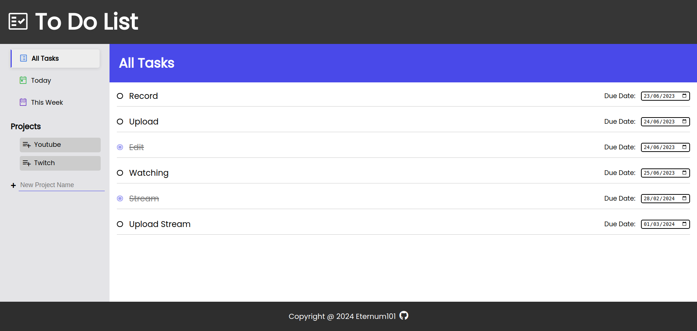

# To Do List

🔗 [View Demo](https://eternum101.github.io/to-do-list/)

## Table of Contents
- [About The Project](#about-the-project)
- [Built With](#built-with)
- [Screenshots](#screenshots)
- [Features](#features)

## About The Project
An Advanced Application of a To Do List.

## Screenshots

### All Tasks Filter

### Todays Tasks Filter

### This Weeks Tasks Filter

### Projects Tasks Filter

[Back to Top](#to-do-list)

## Built With
- HTML
- CSS
- JavaScript
- Webpack

[Back to Top](#to-do-list)

## Features

- Ability to Filter Projects by All Tasks, Tasks with Todays Date & Tasks that Have Dates Within This Week
- Local Storage Implemented
- Create New To Do Projects
- Counting System for Tasks
- Mark off Tasks When Completed
- Create New Task, Clear Completed Tasks & Delete Task
- Edit Due Date

[Back to Top](#to-do-list)
